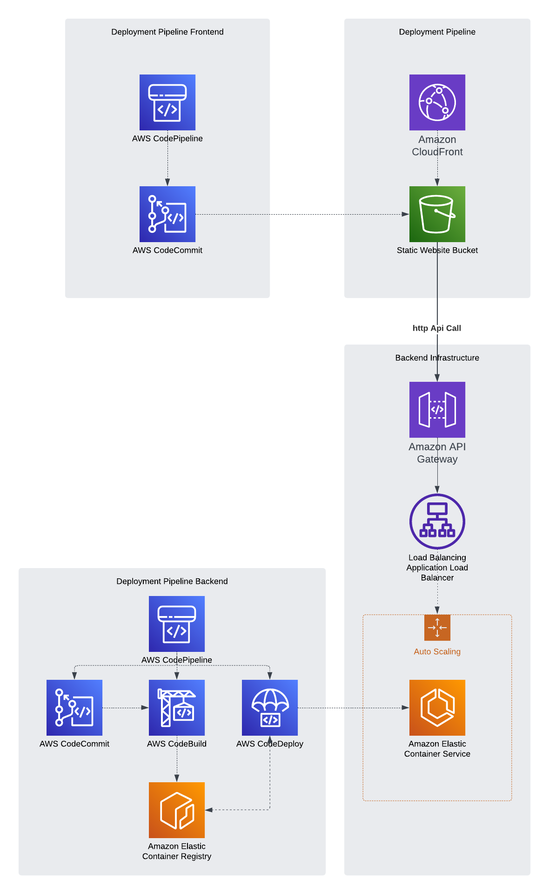

# Tech Demo - Work in Progress

## Introduction
This tech demo showcases a full-stack CloudFormation deployment that includes both backend and frontend infrastructure needed to host microservices and static content. The deployment features a CI/CD workflow using AWS tools such as AWS CodePipeline, CodeBuild, and CodeCommit. 

While observability and logging may be added in the future, the current focus is on keeping the deployment simple due to the substantial infrastructure-as-code created for this basic website and backend. The frontend is built using HTML and basic CSS for testing purposes, and the backend is a simple Flask-based Python application with Swagger integrated for API Gateway.

## CloudFormation Deployments
The CloudFormation deployments are divided into core, backend, frontend, and API Gateway components:

* **Core**: Includes core components such as the Elastic Container Service (ECS) Cluster and the Application Load Balancer (ALB), which must be deployed first.
* **Frontend**: Hosts the frontend CloudFormation templates used to deploy CloudFront and an S3 bucket for hosting the website. This deployment also includes a CI/CD aspect, allowing developers to use CodeCommit for code storage, which then triggers CodePipeline to deploy onto S3.
* **Backend**: Deploys the ECS service, ALB context routing, and the pipeline responsible for building and deploying the container to ECS.
* **API Gateway**: Configures the API Gateway using a Swagger file and deploys the integrated frontend and backend.

The tech demo covers backend and frontend infrastructure deployments, a CI/CD workflow for managing code and deployments, and API Gateway. The diagram below illustrates the overall architecture:

### Diagram

Please note that this is a demo and not intended for real-world use cases with such complex infrastructure for a simple "Hello, World!" application. The deployment may be expanded in the future.

## Work in Progress
More detailed deployment steps and documentation will be added as each component is developed and tested.
